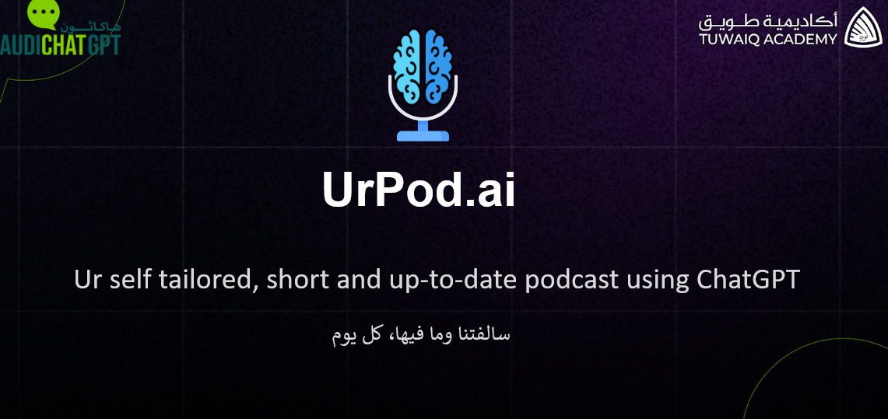

## UrPod
Ur self tailored, short and up-to-date podcast using ChatGPT
"سالفتنا وما فيها، كل يوم"

Presention Link: [Here](https://docs.google.com/presentation/d/e/2PACX-1vQg9HYvUcc9m6BxZ1dFsBNixmBj1BR9brfJ3mdXpR5FCvqXJLd8uerd23sD0gwC2Q/pub?start=false&loop=false&delayms=3000)

## Available Scripts

In the project directory, you can run:

### `npm start`

Runs the app in the development mode.\
Open [http://localhost:3000](http://localhost:3000) to view it in your browser.

The page will reload when you make changes.\
You may also see any lint errors in the console.

### `npm test`

Launches the test runner in the interactive watch mode.\
See the section about [running tests](https://facebook.github.io/create-react-app/docs/running-tests) for more information.
